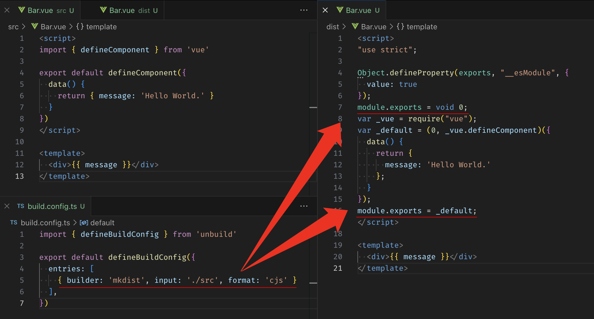
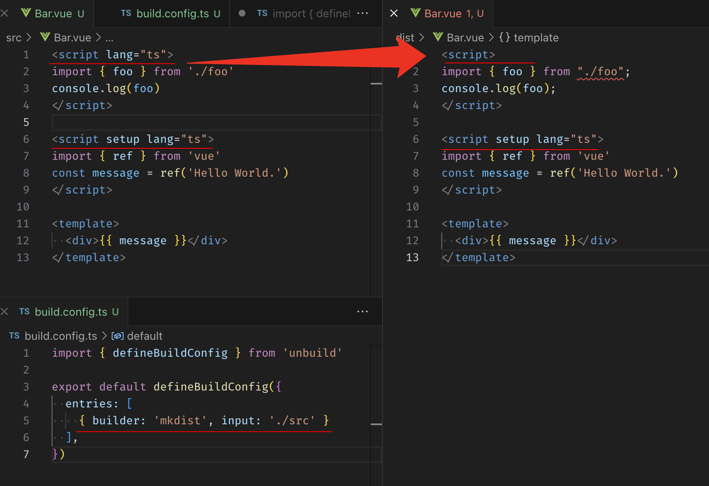
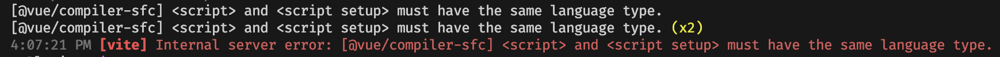

# Some tips for using `mkdist`

I use `unbuild + mkdist` to build component libraries for Vue3, here are some tips for you.

1. [Don't use `format:cjs` to build \*.vue file](#dont-use-formatcjs-to-build-vue-file)
2. [Issue occurred while building \*.vue file with two `<script>` blocks](#issue-occurred-while-building-vue-file-with-two-script-blocks)
3. [Split multiple entries based on file extension](#split-multiple-entries-based-on-file-extension)

## Don't use `format:cjs` to build \*.vue file

When use `format:cjs` to build \*.vue file, the script block in \*.vue will build to `cjs` too.

```typescript
expo default defineBuildConfig({
  entries: [
    // When not specify loaders, resolve `['js', 'css', 'vue']`
    // https://github.com/unjs/mkdist/blob/67e4cd56bf857849a53d185229754c76a0ecaf58/src/loaders/index.ts#L24
    { builder: 'mkdist', input: './src', format: 'cjs' /* loaders: ['js', 'css', 'vue'] */ }
    //                                   ^^^^^^^^^^^^^^^^^^^^^^^^^^^^^^^^^^^^^^^^^^^^^^^^
  ]
})
```



## Issue occurred while building \*.vue file with two `<script>` blocks



As the picture shows, `mkdist` change `<script lang='ts'>` to `<script>`, It will case a build error when use the dist in vitepress.



## Split multiple entries based on file extension

So, the best practice is **Split multiple entries based on file extension**

```typescript
export default defineBuildConfig({
  entries: [
    // *.css -> *.css
    { builder: 'mkdist', input: './src', pattern: ['**/*.css'], loaders: ['sass'] },

    // *.vue -> *.vue
    { builder: 'mkdist', input: './src',pattern: ['**/*.vue'], loaders: ['vue'] },

    // *.ts -> *.js & *.cjs
    // plz keep `esm` after `cjs`
    { builder: 'mkdist', input: './src', pattern: ['**/*.ts'], format: 'cjs', loaders: ['js'] },
    { builder: 'mkdist', input: './src', pattern: ['**/*.ts'], format: 'esm', loaders: ['js'] },
  ],
  clean: true,
  declaration: true,
  externals: ['vue']
})
```

[source code](https://github.com/jsonleex/demo-mkdist) of the demo
